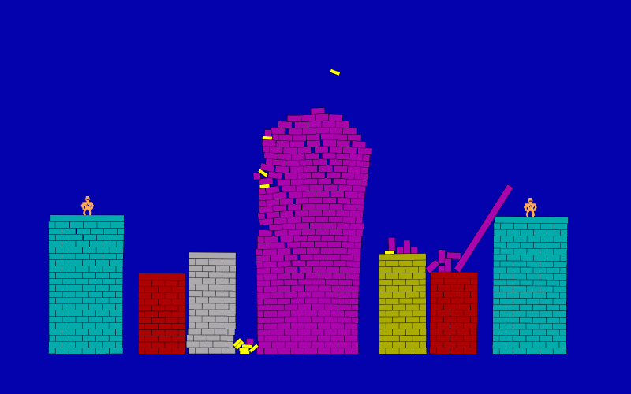

# AWSM Gorillas

Shitty little gorillas clone written in Rust and Javascript using [nphysics](http://nphysics.org/) for the browser.

## play at 

https://naubino.de/awsm-gorillas/ (gamepads required ATM)

## build

1. install [wasm-pack](https://rustwasm.github.io/wasm-pack/installer/) or via [cargo](https://rustup.rs/) `cargo install wasm-pack`
2. run `wasm-pack build` to build your rust to `./pkg`
3. run `yarn install` to install all you need to get this into your browser
4. run `yarn serve` to start webpack
5. keep `yarn serve` running for continuous updates
6. open http://localhost:8080